### Hi there 👋

<!--
**narcisista3g/narcisista3g** is a ✨ _special_ ✨ repository because its `README.md` (this file) appears on your GitHub profile.

Here are some ideas to get you started:

- 🔭 I’m currently working on ...
- 🌱 I’m currently learning ...
- 👯 I’m looking to collaborate on ...
- 🤔 I’m looking for help with ...
- 💬 Ask me about ...
- 📫 How to reach me: ...
- 😄 Pronouns: ...
- ⚡ Fun fact: ...
-->

<div align="center" id="top">
  <h2>
    <i>Developer Back End</i>
  </h2>
  <a href"https://github.com/narcisista3g?tab=followers">
    
  </a>
  <a href="https://twitter.com/strange_silva">
     
  </a>
  <a href="https://discord.gg/6cr4MnsCYY">
    
  </a>
</div>

<br />

<div style="width: 10px;"></div>

<a  href="https://discord.gg/6cr4MnsCYY"></a>

```typescript
import { message } from "narcisistajs";

class Narcisista {
  private message: string[];

  contructor() {
    this.message = ["ts", "js", "py"]
  };

  public async function SendMessage(): Promise<string> {
    const send = await message();

    const msg = send(this.message);

    return msg;
  };
};

export { Narcisista };
```

<br />

<h4 align="center">



</h4>
